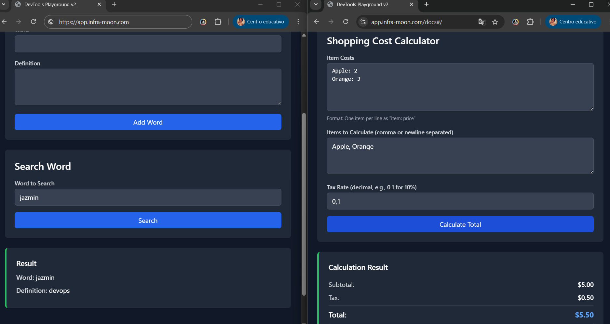
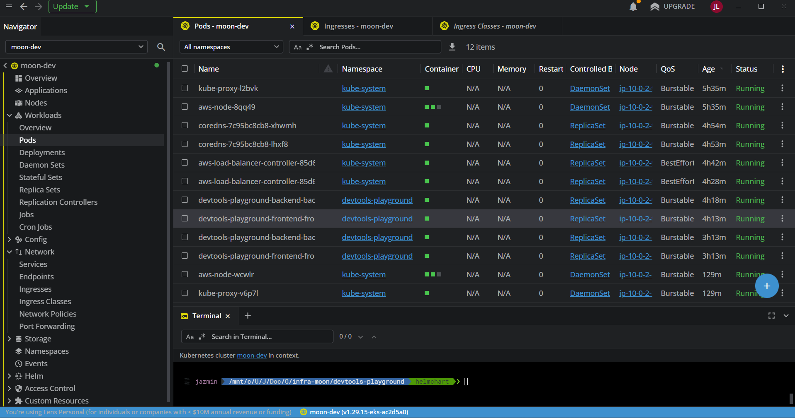

# DevTools Playground - Frontend


## EPAM Project - DevOps Specialization 
**Author:** Jazmin Luna 🌙

**Frontend Built with React and Vite**

Modern React-based frontend application for the DevTools Playground, featuring three interactive programming katas with a beautiful, responsive UI and dark mode support.

**Live Application:**
- **Frontend**: https://app.infra-moon.com/
- **Backend API**: https://api.infra-moon.com/docs

The frontend provides an intuitive user interface for interacting with the backend API, with real-time validation, error handling, and a seamless user experience.

- App Home:

- Features:

- Screenshot of Lens displaying pods:

## Katas:

### Dictionary Management
- Add words with definitions to the dictionary
- Search for word definitions (case-insensitive)
- Real-time form validation and error handling
- Clean, user-friendly interface

### Shopping Cost Calculator
- Calculate shopping cart totals with tax
- Support for both JSON and simple text input formats
- Detailed breakdown of costs, subtotals, and tax calculations
- Input parsing and validation

### Word Concatenation
- Concatenate characters from words based on position
- Visual feedback for extracted and skipped characters
- Interactive form with real-time results
---
### Interactive Features
- **Dark Mode**: Toggle between light and dark themes
- **Tab Navigation**: Easy switching between different katas
- **Responsive Design**: Works seamlessly on desktop and mobile devices
- **Error Handling**: User-friendly error messages and validation
- **Loading States**: Visual feedback during API requests

## Tech Stack

- **Framework**: React 18.2.0
- **Build Tool**: Vite 5.0.8
- **Styling**: Tailwind CSS 3.3.6
- **Runtime**: Node.js 18
- **Testing**: Vitest with Testing Library
- **Web Server**: Nginx (production)
- **Containerization**: Docker (multi-stage builds)
- **Orchestration**: Kubernetes with Helm charts
- **Cloud**: AWS (EKS, ECR, ALB)

## Prerequisites

- Node.js 18+
- npm or yarn
- Docker & Docker Compose (optional, for containerized deployment)
- AWS CLI & kubectl (for Kubernetes deployment)

## Installation

### AWS/Kubernetes Deployment (Production)

The application is deployed to AWS EKS using Helm charts. The frontend serves static assets via Nginx and proxies API requests to the backend service.

**Prerequisites:**
- AWS CLI configured with appropriate credentials
- `kubectl` configured to access the EKS cluster
- Helm 3.x installed
- Access to the ECR repository and EKS cluster

**Deployment Steps:**

1. **Install using Helm chart**
   ```bash
   helm install devtools-frontend ./helm \
     -f ./helm/values-moon-dev.yaml \
     --namespace devtools-playground \
     --create-namespace
   ```

2. **Verify deployment**
   ```bash
   kubectl get pods -n devtools-playground
   kubectl get ingress -n devtools-playground
   ```

**Production Configuration:**
- **Ingress**: AWS ALB Ingress Controller with SSL/TLS termination
- **Service**: ClusterIP service exposing port 80
- **Replicas**: Configurable via Helm values (default: 2)
- **Health Checks**: Liveness and readiness probes configured
- **Resources**: CPU and memory limits/requests defined
- **API Proxy**: Nginx configured to proxy `/api` requests to backend service
- **Static Assets**: Optimized caching for CSS, JS, and images

**Access Points:**
- **Frontend**: https://app.infra-moon.com
- **Backend API**: https://api.infra-moon.com/docs
---
### Docker Deployment (Optional)

For containerized local deployment or testing:

1. **Build the Docker image**
   ```bash
   docker build -t devtools-frontend:latest \
     --build-arg VITE_API_URL=/api .
   ```

2. **Run the container**
   ```bash
   docker run -p 80:80 devtools-frontend:latest
   ```

**Note**: The frontend container expects the backend API to be accessible. For local development, use Docker Compose or configure the API URL appropriately.

#### Dockerfile Overview

The project uses a **multi-stage Docker build** optimized for production deployments with security and performance best practices:

**Key Features:**

- **Multi-stage Build**: Uses a build stage to compile the React application, then serves static files with Nginx
- **Base Images**: 
  - Build stage: `node:18-alpine` - Minimal Node.js image for building
  - Runtime stage: `nginx:alpine` - Lightweight Nginx image for serving static files
- **Build Arguments**: Supports `VITE_API_URL` and `VITE_APP_VERSION` for environment-specific configuration
- **Health Check**: Built-in health check endpoint that monitors port 80 every 30 seconds
- **Optimized Layers**: Dependencies are installed in separate layers for better caching
- **Production Ready**: Configured with appropriate timeouts, retries, and start periods for health checks
- **Nginx Configuration**: Custom Nginx config with security headers, gzip compression, and API proxying

**Build Process:**
1. **Build Stage**: Installs Node.js dependencies, builds the React application with Vite
2. **Runtime Stage**: Copies built static files to Nginx, applies custom configuration
3. **Final Image**: Contains only Nginx and static assets, optimized for size and performance

**Image Size Optimization:**
- Uses Alpine Linux base images for minimal footprint
- Multi-stage build eliminates Node.js and build dependencies from final image
- Only production assets included in final image

### Local Development

For local development and testing, follow these detailed steps:

#### 1. Clone the Repository

```bash
git clone <repository-url>
cd devtools-frontend
```

#### 2. Install Dependencies

```bash
npm install
```

#### 3. Set Up Environment Variables

Create a `.env` file in the root directory (optional):

```env
VITE_API_URL=http://localhost:8000
VITE_APP_VERSION=1.0.0
```

**Note**: If `VITE_API_URL` is not set, the app will use `/api` which is proxied by Vite dev server to `http://localhost:8000`.

#### 4. Start Development Server

```bash
npm run dev
```

**Development Server URLs:**
- **Frontend**: http://localhost:5173
- **API Proxy**: Requests to `/api` are automatically proxied to `http://localhost:8000`

**Development Features:**
- **Hot Module Replacement (HMR)**: Code changes automatically update in the browser
- **Fast Refresh**: React components update without losing state
- **API Proxy**: Vite dev server proxies `/api` requests to backend
- **Source Maps**: Full debugging support in browser DevTools

#### 5. Build for Production

```bash
npm run build
```

This creates an optimized production build in the `dist/` directory.

#### 6. Preview Production Build

```bash
npm run preview
```

This serves the production build locally for testing.

## Testing

Run the test suite:

```bash
npm test
```

Run with coverage report:

```bash
npm run test:coverage
```

**Test Configuration:**
- **Framework**: Vitest
- **Environment**: jsdom (simulates browser environment)
- **Testing Library**: React Testing Library for component testing
- **Coverage**: V8 coverage provider with multiple output formats

## Project Structure

```
devtools-frontend/
├── src/
│   ├── components/          # React components
│   │   ├── common/          # Reusable UI components
│   │   │   ├── ErrorCard.jsx
│   │   │   ├── FormInput.jsx
│   │   │   ├── FormTextarea.jsx
│   │   │   ├── ResultCard.jsx
│   │   │   └── SubmitButton.jsx
│   │   ├── dictionary/      # Dictionary kata components
│   │   │   ├── WordForm.jsx
│   │   │   └── WordSearch.jsx
│   │   ├── shopping/        # Shopping calculator components
│   │   │   ├── ShoppingForm.jsx
│   │   │   └── ShoppingResult.jsx
│   │   ├── words/           # Word concatenation components
│   │   │   ├── WordConcatForm.jsx
│   │   │   └── WordConcatResult.jsx
│   │   ├── DictionaryTool.jsx
│   │   ├── ShoppingTool.jsx
│   │   ├── WordsTool.jsx
│   │   ├── TabNavigation.jsx
│   │   └── ThemeToggle.jsx
│   ├── hooks/               # Custom React hooks
│   │   ├── useApi.js        # API request handling
│   │   ├── useAsyncOperation.js
│   │   └── useTheme.js      # Dark mode management
│   ├── services/            # API service layer
│   │   └── apiService.js    # Centralized API client
│   ├── utils/               # Utility functions
│   │   ├── constants.js
│   │   ├── parsers.js       # Input parsing utilities
│   │   └── validation.js    # Form validation
│   ├── test/                # Test setup files
│   │   └── setup.js
│   ├── App.jsx              # Main application component
│   ├── main.jsx             # Application entry point
│   └── index.css            # Global styles
├── helm/                    # Kubernetes Helm charts
│   └── values-moon-dev.yaml
├── .github/
│   └── workflows/           # CI/CD pipelines
│       ├── ci-cd.yml
│       └── template-*.yml   # Reusable workflows
├── Dockerfile               # Docker image definition
├── nginx.conf               # Nginx configuration (production)
├── vite.config.js           # Vite configuration
├── tailwind.config.js       # Tailwind CSS configuration
├── postcss.config.js        # PostCSS configuration
├── package.json             # Dependencies and scripts
└── README.md                # This file
```

## CI/CD Pipeline

The project uses GitHub Actions with a modular architecture based on reusable workflow templates. This approach significantly improves pipeline readability and maintainability by separating concerns into dedicated template files.

### Pipeline Structure

The main pipeline (`ci-cd.yml`) orchestrates the following stages using reusable workflow templates:

- **Lint & Test** (`template-lint-and-test.yml`): ESLint linting and unit tests with Vitest
- **SonarCloud Analysis** (`template-sonarcloud-analysis.yml`): Code quality and security scanning
- **Build & Push** (`template-build-and-push.yml`): Docker image build and push to AWS ECR
- **Deploy** (`template-deploy-dev.yml`): Helm-based deployment to AWS EKS

### Benefits of Template-Based Architecture

- **Improved Readability**: The main pipeline file is concise and focuses on orchestration rather than implementation details
- **Reusability**: Templates can be shared across multiple projects or pipelines
- **Maintainability**: Changes to a specific stage only require updating the corresponding template file
- **Separation of Concerns**: Each template encapsulates a single responsibility (linting, testing, building, deploying)
- **Easier Testing**: Individual templates can be tested and validated independently

The main pipeline file acts as a high-level orchestrator, passing configuration parameters to each template workflow, making it easy to understand the overall CI/CD flow at a glance.

## Environment Variables

| Variable | Description | Default |
|----------|-------------|---------|
| `VITE_API_URL` | Backend API URL | `/api` (proxied) |
| `VITE_APP_VERSION` | Application version | `1.0.0` |

**Note**: Vite requires environment variables to be prefixed with `VITE_` to be exposed to the client-side code.

## Nginx Configuration

The production Nginx configuration includes:

- **Security Headers**: X-Frame-Options, X-Content-Type-Options, X-XSS-Protection
- **Gzip Compression**: Enabled for text-based assets
- **Static Asset Caching**: 1-year cache for CSS, JS, images, and fonts
- **API Proxying**: Routes `/api` requests to backend service
- **SPA Routing**: Fallback to `index.html` for client-side routing
- **Health Check Endpoint**: `/health` endpoint for Kubernetes probes

## License

This project is licensed under the MIT License.

## Contributing

Contributions are welcome! Please feel free to submit a Pull Request.

1. Fork the repository
2. Create your feature branch (`git checkout -b feature/AmazingFeature`)
3. Commit your changes (`git commit -m 'Add some AmazingFeature'`)
4. Push to the branch (`git push origin feature/AmazingFeature`)
5. Open a Pull Request

## Support

For support, email jluna2554@gmail.com or open an issue in the repository.

---

